## 1. 테이블 쪼개기

### 쪼개 지지 않은 테이블

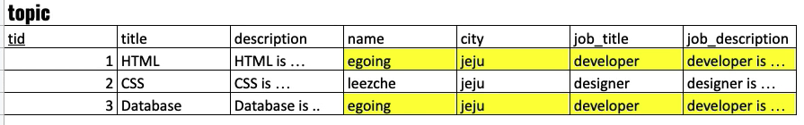

* 이 Topic 테이블의 장점은 한눈에 읽기가 쉽다는 점이다.
* 그러나, 노란색으로 표시된 것과 같이 중복이 존재하게 된다.
* 쓰기가 힘들다


### 테이블 쪼개기

#### 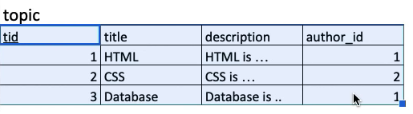

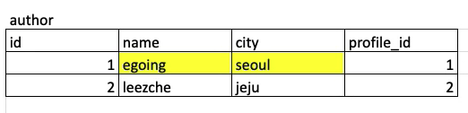

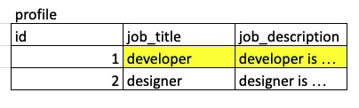


* 위의 Topic 테이블을 쪼개서 3개의 테이블로 만든 경우 이다.
* 이때 장점은 쓰기, 수정하기가 매우 편한다
* 반면에, 테이블 3개를 모두 봐야하는데, 한눈에 들어오지 않는다. - 읽기가 불편하다


> 위 2가지 경우 모두 `Trade off`가 존재한다. 따라서, 상황에 따라서 적절하게 활용해야 한다.


## 2. JOIN 간단 소개

### INNER JOIN

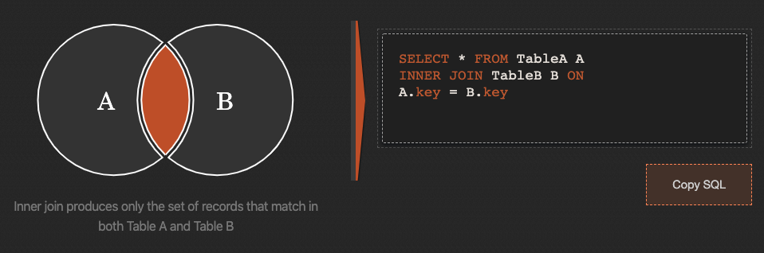


### LEFT JOIN

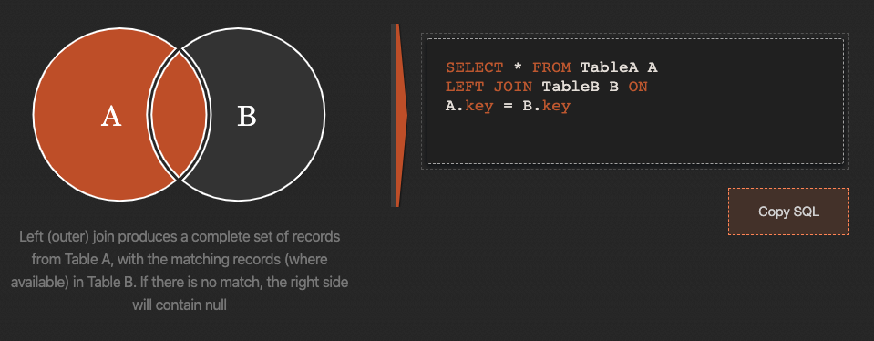


### RIGHT JOIN

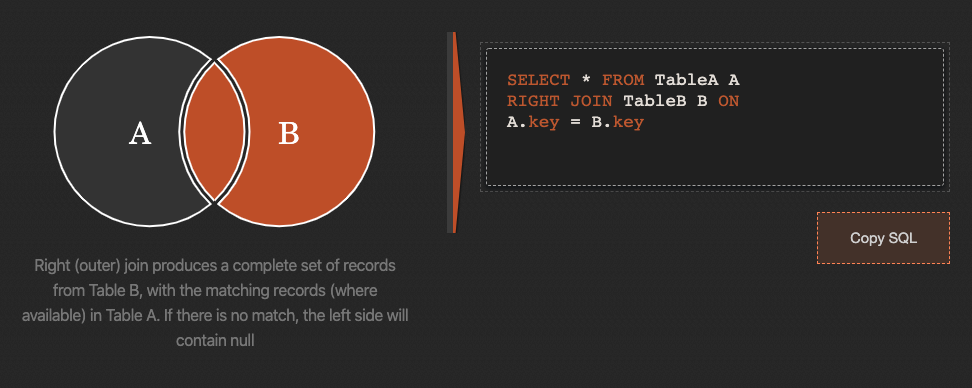


### FULL OUTER JOIN

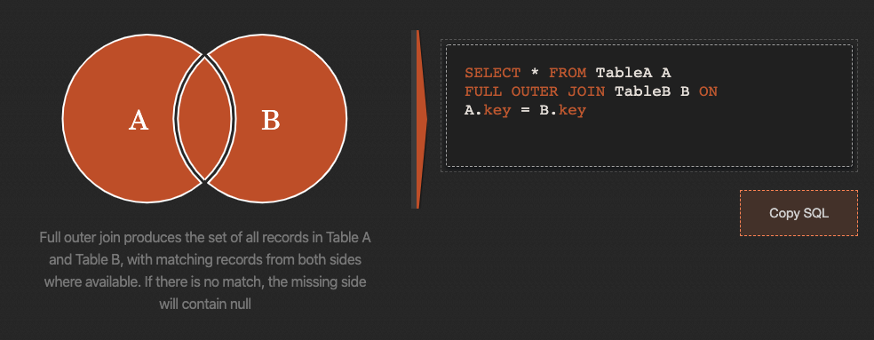


## 3. LEFT JOIN


* 왼쪽에만 있는 정보를 출력 하는 것
* 특정한 표(A)를 기준으로 정보를 가지고 올 떄,(A에는 있고, B에는 없는 정보를 가져 올 때)


```SQL
# topic과 author의 left join
SELECT * FROM topic LEFT JOIN author on topic.author_id = author.aid;
```

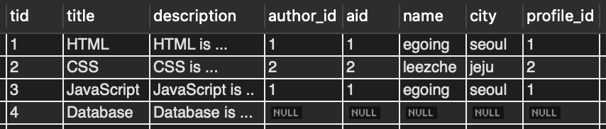

* Left Join 했을 때, NULL 이 나온다는 것 왼쪽에 있는 테이블에는 값이 있는데, 그 값에 해당되는 오른쪽 테이블의 행이 없다는 것


```sql
# topic과 author의 left join 한 결과에 profile을 left join
SELECT * 
FROM topic 
LEFT JOIN author 
on topic.author_id = author.aid 
LEFT JOIN profile ON author.profile_id = profile.pid;
```

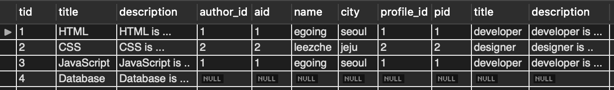


```sql
SELECT tid, topic.title, author_id, name, profile.title AS job_title
FROM topic 
LEFT JOIN author 
on topic.author_id = author.aid 
LEFT JOIN profile ON author.profile_id = profile.pid;
```


```sql
SELECT tid, topic.title, author_id, name, profile.title AS job_title
FROM topic 
LEFT JOIN author 
on topic.author_id = author.aid 
LEFT JOIN profile ON author.profile_id = profile.pid
WHERE aid = 1;
```

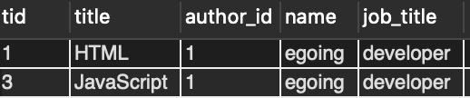


## 4. INNER JOIN


* 양쪽 모두 공통으로 들어있는 행을 보여준다.
* NULL이 존재 하지 않는다.


```sql
SELECT * 
FROM topic 
INNER JOIN author 
ON topic.author_id = author.aid
INNER JOIN profile
ON author.profile_id = profile.pid;
```

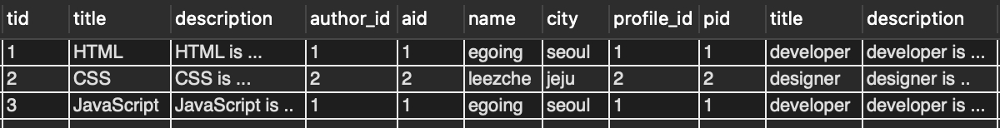


## 5. FULL OUTER JOIN


* 일종의 합집합


```sql
(SELECT * FROM topic LEFT JOIN author ON topic.author_id = author.aid) 
UNION 
(SELECT * FROM topic RIGHT JOIN author ON topic.author_id = author.aid)
```

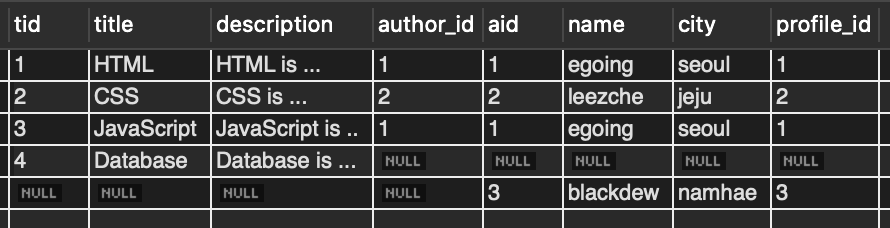

* `INNER JOIN`의 결과 + `A에만 있는 행` + `B에만 있는 행`을 보여준다.
* `FULL OUTER JOIN` 자체를 `DBMS`에서 제공하진 않고, 위와 같이 `UNION` 으로 보여 줄 수 있다.


## 6. EXCLUSIVE LEFT JOIN

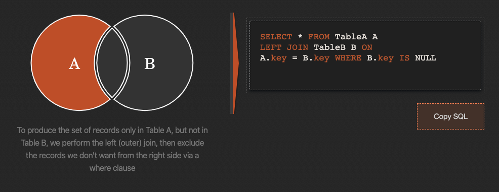

* 어느 특정 테이블에 있는 것만 가져올 수 있다.


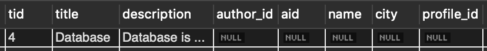

````sql
SELECT * 
FROM topic LEFT JOIN author 
ON topic.author_id = author.aid 
WHERE author.aid is NULL;
````

